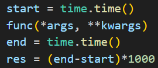
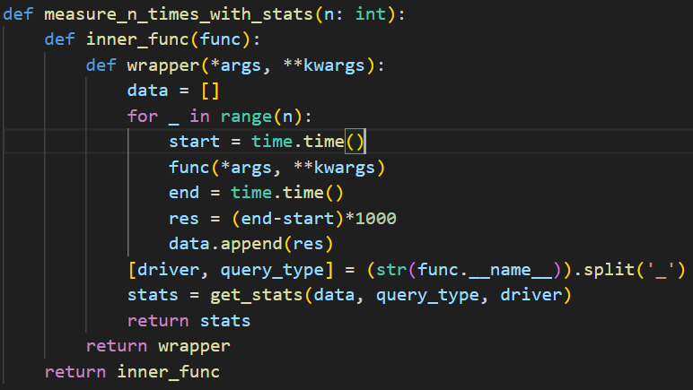
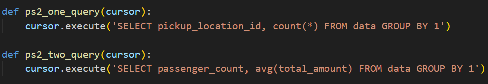
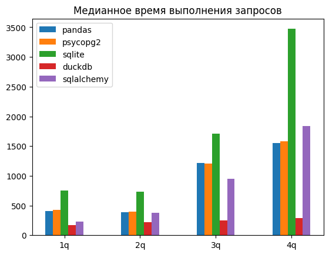

# Лабораторная работа 3

# Оглавление

- [Лабораторная работа 3](#лабораторная-работа-3)
- [Оглавление](#оглавление)
  - [Цель работы](#цель-работы)
  - [Обзор используемых библиотек](#обзор-используемых-библиотек)
    - [psycopg2](#psycopg2)
    - [sqlite3](#sqlite3)
    - [DuckDB](#duckdb)
    - [Pandas](#pandas)
    - [SQLAlchemy](#sqlalchemy)
  - [Метод сравнения](#метод-сравнения)
  - [Кодирование](#кодирование)
  - [Результаты](#результаты)
  - [Выводы](#выводы)
  - [Ссылки](#ссылки)

## Цель работы

Целью данной работы было сравнить используемые в промышленной разработке библиотеки по работе с базами данных. Для успешного выполнения её было обозначено несколько задач:
- Изучить методы определения производительности ПО для работы с БД
- Изучить ключевые особенности работы выбранных для исследования библиотек
- Написать программу, реализующую методы определения производительности, и с её помощью получить данные по производительности для каждой из библиотек
- Полученные результаты сравнить и проанализировать

## Обзор используемых библиотек
Было выбрано 5 различных библиотек, которые позволяют взаимодействовать с базами данных в языке Python. Это:
- psycopg2
- sqlite3
- DuckDB
- Pandas
- SQLAlchemy

Коротко рассмотрим каждую из них.

### psycopg2

Это минималистичная библиотека (драйвер) для работы с СУБД PostgreSQL из кода на Python. Она является достаточно тонкой прослойкой между программистом и API СУБД, так что с её помощью можно писать любые поддерживаемые Postgres запросы. Не отображает результаты запросов на объекты классов в Python.

### sqlite3

sqlite3 представляет собой библиотеку для работы с СУБД SQLite. Особенность здесь заключается в самой СУБД, которая не использует отдельный сервер (как, к примеру, PostgreSQL), а хранит свои данные в отдельном `.db` файле, который может находиться в любом месте.

### DuckDB

DuckDB - легковесная СУБД, аналогичная по своему существу SQLite. Однако, в отличие от sqlite3, библиотека duckdb не включена в стандартный пакет Python и устанавливается отдельно.

### Pandas

Pandas - библиотека для анализа данных, которая также позволяет исполнять запросы к СУБД. С ней можно использовать и серверные СУБД, как PostgreSQL, и встраиваемые, как SQLite. Pandas к общему функционалу исполнения запросов добавляет отображение результата запроса на свой класс DataFrame, предоставляющий удобный интерфейс для работы с табличными данными.

### SQLAlchemy

SQLAlchemy - мощная ORM библиотека, позволяющая работать с различными СУБД, как реляционными, так и нет. Это значит, что она абстрагирует разработчика от написания простых запросов и перевода почти 'сырых' данных из них в объекты классов (это важно, в условиях популярности подхода ООП в наше время). Однако слой ORM не позволяет писать сложные запросы (с использованием, например, аггригирующих функций), поэтому в SQLAlchemy оставлена возможность писать запросы в чистом виде и обрабатывать их 'руками'.

## Метод сравнения

Для сравнения производительности библиотек использовалось 4 эталонных запроса к БД и датасет на 200 МБ. Запросы:

- `SELECT pickup_location_id, count(*) FROM data GROUP BY 1`
- `SELECT passenger_count, avg(total_amount) FROM data GROUP BY 1`
- `SELECT passenger_count, extract(year from tpep_pickup_datetime), count(*) FROM data GROUP BY 1, 2`
- `SELECT passenger_count, extract(year from tpep_pickup_datetime), round(trip_distance) FROM data GROUP BY 1, 2, 3 ORDER BY 2, 3 DESC`
  
Для запросов на SQLite и DuckDB немного изменялся синтаксис в 3 и 4 запросе, на общую семантику это не влияло.

Для каждого запроса засекалось время от исполнения предыдущей инструкции (первый клик секундомера) до исполнения следующей инструкции после выполнения запроса (второй клик секундомера). Каждая отсечка секундомера является количеством миллисекунд, прошедших с 1 Января 1970 года (стандартная дата начала эпохи для измерения временной отметки timestamp). Таким образом, временем на выполнение запроса считается разница между второй отсечкой и первой.

Для увеличения точности каждый из запросов повторялся 1000 раз, в результирующей статистике учитывалось медианное время в миллисекундах.

Измерение проводилось в неизолированной среде (на том же устройстве, где происходило написание кода для исследования), сам способ отсчёта времени не является наиболее точным, поскольку не учитывает возможности прерывания работы программы со стороны ОС, поэтому автор не претендует на эталонность исследования.

## Кодирование

Код для анализа писался на языке Python версии 3.9.13. В первую очередь был написан профилировщик. Было решено использовать параметризованный декоратор, чтобы иметь возможность задавать необходимо число циклов запуска тестируемой функции. Возвращаемое значение функции игнорируется, вместо неё возвращается собранная статистика.

После этого для каждой библиотеки были реализованы запросы, используемые в сравнении.

Также были написаны функции для создания условий работы теста (подключение к СУБД) и cleanup-а (закрытие соединений).

Результаты тестов сохранялись в `.csv` файл, расположение которого настраивалось соответствующей переменной окружения, для открытости работы этим расположением была обозначена поддиректория проекта `artifacts`.

После сохранения на машине, файл для дальнейшего анализа выгружался в Deepnote (ссылка будет дана в конце отчёта).

## Результаты

Результаты сравнения оказались следующими:

Для автора достаточно удивительно, что DuckDB показал такие высокие показатели, в сравнении с остальными библиотеками. Причины этого остаются неясными, расследование показало, что работа функции не прерывалось ошибкой.

Более интересными тут являются показатели остальных 4-х библиотек. Как и ожидалось, запросы с использованием в качестве СУБД PostgreSQL оказались более эффективными ввиду больше приспособленности Postgres к использованию в условиях большого объёма данных. SQLite, хоть и является гораздо более легковесным, не обладает таких инструментов оптимизации запросов, которые позволили бы ему эффективно осуществлять операции на большом хранилище.

Из библиотек, использующих в качестве СУБД PostgreSQL, не вполне ясно, по какой причине SQLAlchemy сначала показал большую производительность, но её сравнительное снижение можно связать с наличием в архитектуре библиотеки ORM прослойки, которая тормозит использование более низкоуровневых инструментов.

В целом, результаты Pandas и psycopg2 показали достаточную эффективность, которая вполне очевидна исходя из практически полного отсутстивия оверхеда для работы с СУБД.

## Выводы

Выводом данной работы можно обозначить следующее:

- Использование SQLAlchemy удобно при архитектуре приложения, подразумевающей частое применение стандартных CRUD операций над объектами с возможностью применения ООП и ORM и,отсутствии более сложных паттернов применения SQL запросов, в иных случаях лучше использовать Pandas или psycopg2
- SQLite удобен в небольших приложениях, поскольку у него нет необходимости в настройки отдельного сервера.
- DuckDB - интересная лошадка

## Ссылки

[Deepnote с анализом статистики](https://deepnote.com/workspace/database-benchmarks-48f98c3e-966a-4293-990e-9fb861aa9ec9/project/4719f3ab-ec4f-4147-a20c-24511fa703f3/notebook/Databases%20Lab%203-d9e74b3a6d514756a3321aa070c51687?project-sidebar=project)